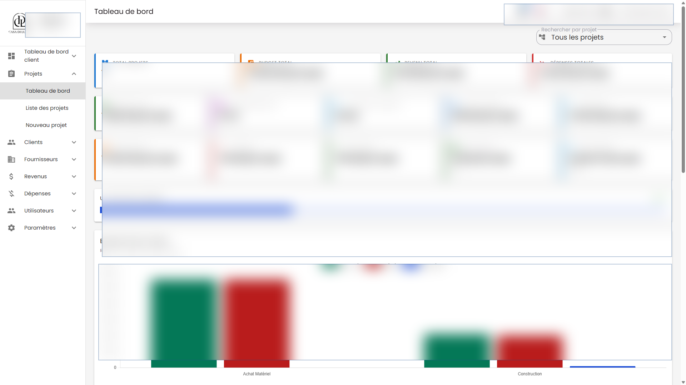
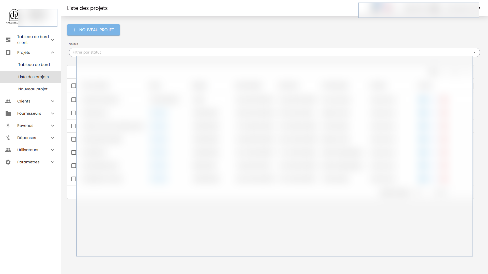

# Management Projet Backend

Django REST API for a project operations platform for clients, suppliers, projects, expenses, revenues, attachments, budgets, payment schedules, dashboards, notifications, and user management.

This is a production-oriented business backend. It models real operational workflows, authenticated staff access, API filtering, document/report generation, realtime notification plumbing, and testable domain behavior.

## What It Shows

- Backend ownership for a complete internal business application.
- Django REST API design across related business modules.
- PostgreSQL data modeling for operational records and audit/history needs.
- Auth, permissions, SSO subject handling, filters, dashboards, exports, and realtime events.
- Testable backend code with pytest tooling instead of only manual checks.

## Main Modules

- account
- project
- depense
- revenu
- core
- notification
- ws

## Key Capabilities

- Django REST API for projects, clients, suppliers, expenses, revenues, attachments, dashboard metrics, and users.
- Project financial model with real budget entries, payment schedules, revenue/expense workflows, supplier records, and document exports.
- PDF generation with ReportLab plus media/file handling for attachments and project documents.
- JWT/session auth, SSO subject support, django-filter, django-axes, and history-aware records.
- Realtime notifications/websocket runtime through Channels, Daphne, Redis, and Celery-ready dependencies.
- pytest coverage around project, revenue, expense, supplier, and dashboard behavior.

## Stack

- Python, Django 6, Django REST Framework
- PostgreSQL, django-filter, django-simple-history
- SimpleJWT, dj-rest-auth, django-axes, CORS
- Redis, Channels, channels-redis, Daphne, Celery-ready runtime
- Gunicorn, WhiteNoise, Pillow/OpenCV where media handling is needed
- pytest, pytest-django, pytest-cov, pytest-asyncio, pytest-xdist

## Related Repository

- Frontend: [Altroo/management_projet_frontend](https://github.com/Altroo/management_projet_frontend)

## Product Screenshots

Redacted production UI screens powered by this API. Sensitive names, amounts, dates, and records are blurred.





## Local Setup

Create local-only environment variables for Django settings, database, Redis, media/static storage, CORS, and allowed hosts. Do not commit `.env` files or production credentials.

```bash
python -m venv .venv
source .venv/bin/activate
pip install -r requirements.txt
python manage.py migrate
python manage.py runserver 8003
```

On Windows, activate with `.venv\Scripts\activate`.

## Tests

```bash
python -m pytest
python -m pytest --cov
```

## Portfolio Note

The repository is public for portfolio review. Screenshots are redacted, and sensitive production values are intentionally hidden.
