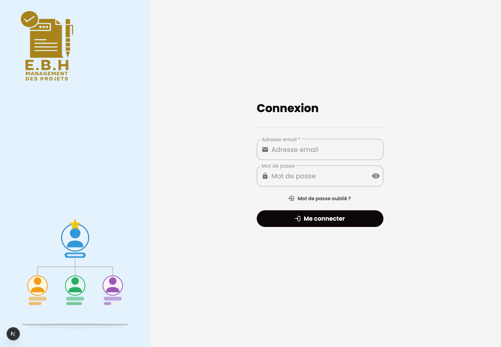

# Management Projet Backend

## Purpose

Management Projet Backend is the Django API for project operations. It manages projects, clients, suppliers, expenses, revenues, attachments, notifications, users, and dashboard data.

## Stack

- Python and Django
- Django REST Framework
- Simple JWT and dj-rest-auth
- django-filter
- Channels, Daphne, Redis, and Celery
- PostgreSQL
- ReportLab
- Pytest and pytest-django

## Features

- Project, client, and supplier APIs
- Expense and revenue tracking
- Attachment and document support
- Dashboard metrics
- User and permission management
- Notifications and websocket integration

## Setup

Provide local-only variables for Django runtime settings, database, Redis, media storage, and allowed origins. Use localhost values for local development and do not commit local configuration files.

```bash
python -m venv .venv
source .venv/bin/activate
pip install -r requirements.txt
python manage.py migrate
python manage.py runserver 8003
```

## Tests

```bash
python -m pytest
```

## Screenshot


