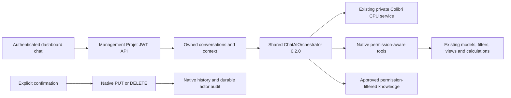

# Chat AI Assistant: Management Projet architecture

The approved Phase 2 integration extends the existing centralized Python engine and Colibri CPU model. It introduces no separate inference service or commercial AI API. Management Projet exposes a native Django adapter because its JWT identities, permissions and database differ from Facturation. Numeric user IDs are never equated across applications.

`vendor/chat-ai-core-manifest.json` identifies the exact shared wheel and source hashes. Optional application system-prompt/tool-selector hooks leave Facturation's default adapter behavior intact. Facturation's deployed wheel and application source have not been replaced. Its 831 assistant regression tests passed against the shared extension locally.

Business data and conversation persistence remain inside the native application security boundary. Only bounded user questions, approved tool schemas and reviewed workflow documentation enter inference. Historic financial outputs are not replayed to the planner. Read results are rendered from authoritative backend cards; the model does not recalculate money or invent links.

Management Projet has one `CompanyProfile`, not company memberships or a company selector. Workspace key `1` is an adapter namespace, not a company primary key. Every other workspace is rejected. Future applications require their own native identity/permission adapters; none is implemented in this rollout.
